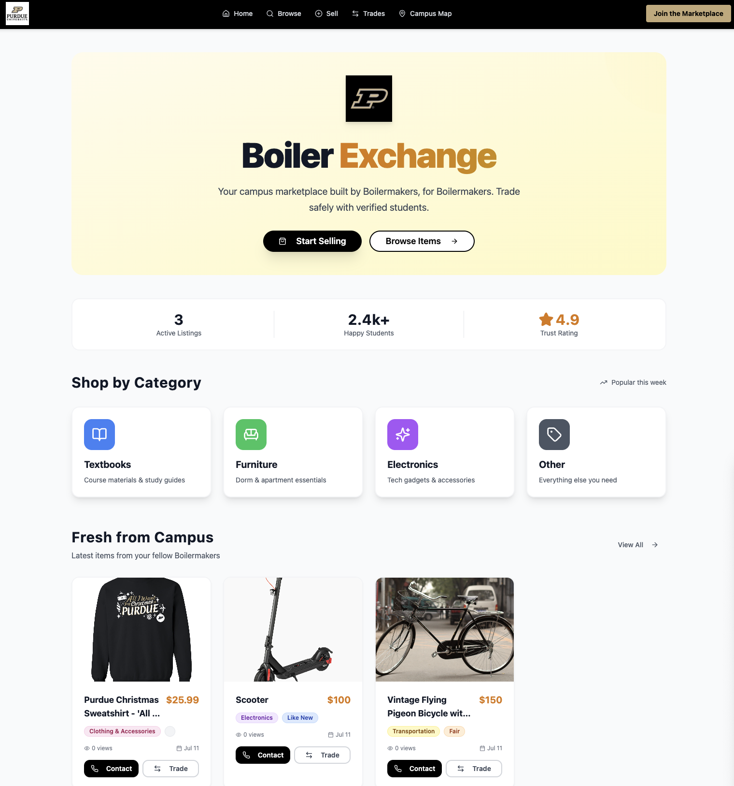

# Boiler Store 🚂 - Buy, Sell and Trade Items with other University Students

## Ditch the Facebook Groups. Hook Up with Boiler Store.

Every semester, Purdue students face the same challenge: buying and selling gear. Textbooks, mini-fridges, bikes, that extra desk lamp... it's a hassle. Boiler Store is here to change that. We're building **Purdue's official, secure, and student-first marketplace.**

# http://bit.ly/3GIDBpd

### 🤔 Why Boiler Store?

*   **Tailored for Purdue:** Designed from the ground up for Boilermakers, using familiar campus locations and a trusted community.
*   **No More Scams:** Features like secure meetup location suggestions (on-campus!), and verified student profiles mean safer transactions.
*   **Effortless Listing:** Snap a pic, let our AI suggest details, and your item is live. Seriously, it's that easy.
*   **Smart Trading:** Cash isn't always king. Propose trades with other items, opening up new possibilities.
*   **Find Anything, Fast:** Powerful search and intelligent filters cut through the noise to get you what you need.
*   **Your Data, Your Way:** Built on a robust, modern stack that prioritizes speed and reliability.

---

### ✨ What You'll Find Inside (Key Features)

*   **Campus-Centric Marketplace:** Browse, list, and trade items specifically within the Purdue community.
*   **AI-Powered Listing Assistant:** Get instant suggestions for item titles, categories, and fair pricing just by uploading a photo.
*   **Secure Transaction Tools:** Integrated contact features, and proposed safe meetup points around campus (Purdue Memorial Union, Co-Rec, Krach, etc.).
*   **Intuitive Trade System:** Seamlessly offer your items in Store for others, and manage your trade proposals.
*   **Dynamic Search & Filtering:** Quickly narrow down thousands of listings by category, condition, price, and more.
*   **Personalized Dashboards:** Track your active listings, past sales, and items of interest.
*   **Voice Search:** "Find me a textbook for CS 307!" – just talk to the app.

---

### ⚙️ Under the Hood (Technical Highlights)

Boiler Store is a single-page application (SPA) designed for performance and scalability, leveraging a cloud-first approach:

*   **Frontend:** Built with **React**, styled beautifully with **Tailwind CSS** and **shadcn/ui** components.
*   **Backend & Data:** Powered by **Base44**, providing a managed platform for:
    *   **Entity Persistence:** All application data (listings, users, trades, messages) is stored in a scalable cloud database.
    *   **Authentication:** Secure user login via Google OAuth, handled seamlessly.
    *   **File Storage:** Cloud storage for all listing images.
    *   **Core Integrations:** Pre-built modules for common tasks like sending emails or invoking Large Language Models (LLMs).
*   **Serverless Logic:** Custom backend functions (e.g., AI integration, compliance checks, demand forecasting, voice search parsing) are deployed as **Deno Deploy** serverless functions, ensuring global distribution and automatic scaling.
*   **AI Integration:** Leverages **OpenAI** for intelligent listing suggestions and content moderation, ensuring a clean and compliant marketplace.

---

### 🚀 Get Started

1.  **Visit Boiler Store:** Navigate to the live application URL (or deploy it via your Base44 workspace).
2.  **Sign Up/Login:** Use your Purdue email for a quick and secure sign-up process.
3.  **Explore or List:** Dive into listings, or start selling your own items in minutes!

---

### 🤝 Contribute

As a constantly evolving platform, we welcome contributions! If you have ideas for new features, find bugs, or want to improve existing functionality, please refer to the technical documentation or reach out.

**Boiler Up! 🤘**
